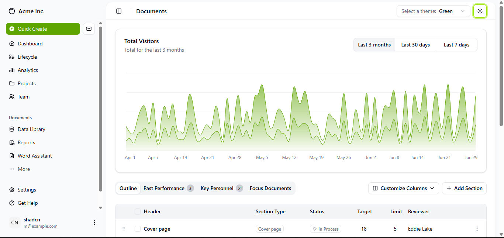
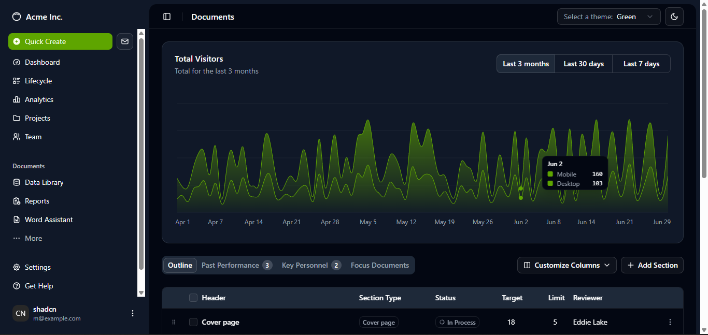

# Shadcn Dashboard with Theme Switcher

A modern, responsive dashboard built using [Shadcn UI](https://ui.shadcn.com/) components and Tailwind CSS. This project features **dynamic theme switching**, **dark/light mode**, and fully customizable UI via CSS variables.

---

## Features

- ✅ Responsive dashboard layout  
- 🎨 Multiple color themes: default, blue, green, amber, rose, purple, orange, teal, red, violet, yellow  
- 🌙 Dark and light mode support with system theme detection  
- ⚡ Easy theme switching using buttons or a dropdown  
- 🛠️ Built with React, Tailwind CSS, and Shadcn components  
- 💡 Customizable CSS variables for charts, sidebar, cards, and other UI elements  

---

## Demo Screenshots

  
  

---

## Installation

1. **Clone the repository**

```bash
git clone https://github.com/your-username/shadcn-dashboard.git
cd shadcn-dashboard
npm install
npm run dev

Visit http://localhost:5173 to view your dashboard.


